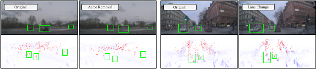

<p align="center">
    <!-- paper badges -->
    <a href="https://arxiv.org/abs/2504.00859">
        
    </a>
</p>

<div align="center">
<h4 style="font-size:1.5em;">
NeuRadar: Neural Radiance Fields for Automotive Radar Point Clouds
</h4>
</div>
<div align="center">

<div align="center">
<picture>
    
</picture>
</div>

</div>

<h4>Code to be released.</h4>

# About
This is the official repository for _NeuRadar: Neural Radiance Fields for Automotive Radar Point Clouds_.

### Abstract
Radar is an important sensor for autonomous driving (AD) systems due to its robustness to adverse weather and different lighting conditions. Novel view synthesis using neural radiance fields (NeRFs) has recently received considerable attention in AD due to its potential to enable efficient testing and validation but remains unexplored for radar point clouds. In this paper, we present NeuRadar, a NeRF-based model that jointly generates radar point clouds, camera images, and lidar point clouds. We explore set-based object detection methods such as DETR, and propose an encoder-based solution grounded in the NeRF geometry for improved generalizability. We propose both a deterministic and a probabilistic point cloud representation to accurately model the radar behavior, with the latter being able to capture radar's stochastic behavior. We achieve realistic reconstruction results for two automotive datasets, establishing a baseline for NeRF-based radar point cloud simulation models. In addition, we release radar data for ZOD's Sequences and Drives to enable further research in this field.

# TODOs
- [x] Release code

# Quickstart

## 1. Installation: Setup the environment

### Prerequisites

Our installation steps largely follow NeuRAD. You must have an NVIDIA video card with CUDA installed on the system. This library has been tested with version 11.8 of CUDA. You can find more information about installing CUDA [here](https://docs.nvidia.com/cuda/cuda-quick-start-guide/index.html).

### Create environment

The models require `python >= 3.10`. We recommend using conda to manage dependencies. Make sure to install [Conda](https://docs.conda.io/miniconda.html) before proceeding.

```bash
conda create --name neuradar -y python=3.10
conda activate neuradar
pip install --upgrade pip
```

### Dependencies

Install PyTorch with CUDA 11.8 and [tiny-cuda-nn](https://github.com/NVlabs/tiny-cuda-nn).
`cuda-toolkit` is required for building `tiny-cuda-nn`.

```bash
pip install torch==2.0.1+cu118 torchvision==0.15.2+cu118 --extra-index-url https://download.pytorch.org/whl/cu118

conda install -c "nvidia/label/cuda-11.8.0" cuda-toolkit

# Some need to upgrade dill prior to tiny-cuda-nn install
pip install dill --upgrade
pip install --upgrade pip "setuptools<70.0"

pip install ninja git+https://github.com/NVlabs/tiny-cuda-nn/#subdirectory=bindings/torch
```

We refer to [NeuRAD](https://github.com/georghess/neurad-studio?tab=readme-ov-file#) and [Nerfstudio](https://github.com/nerfstudio-project/nerfstudio/blob/v1.0.3/docs/quickstart/installation.md) for more installation support.

### Installing neuradar
```bash
git clone git@github.com:mrafidashti/neuradar.git
cd neuradar
pip install -e .
```

## 2. Data Preparation

1. Please create a directory `./data` in the root directory of the repository.

2. Download [Zenseact Open Dataset (ZOD)](https://github.com/zenseact/zod).

3. Download [View-of-Delft (VoD)](https://intelligent-vehicles.org/datasets/view-of-delft/).

4. Softlink the files into the `./data` directory. The structure of the data directory should be as follows:

```shell script
neuradar
    ├──data
    │   ├── zod
    │   │  ├── trainval-sequences-full.json
    │   │  ├── auto_annotations
    │   │  └── sequences
    │   ├── vod
    │   │  ├── lidar
    │   │  └── radar
    └──...
```
Notably,
- Only the necessary subdirectories are shown in the structure above.
- The full ZOD sequences occupy 1.5 TB. To save space, you can keep only the sequences you’re interested in.

## 3. Train Model

Training is done as in nerfstudio and neurad-studio. You can simply run:
```bash
python nerfstudio/scripts/train.py neuradar zod-data
```


## Citation
```bibtex
@inproceedings{rafidashti2025neuradar,
  title={NeuRadar: Neural Radiance Fields for Automotive Radar Point Clouds},
  author={Rafidashti, Mahan and Lan, Ji and Fatemi, Maryam and Fu, Junsheng and Hammarstrand, Lars and Svensson, Lennart},
  booktitle={Proceedings of the Computer Vision and Pattern Recognition Conference},
  pages={2488--2498},
  year={2025}
}
